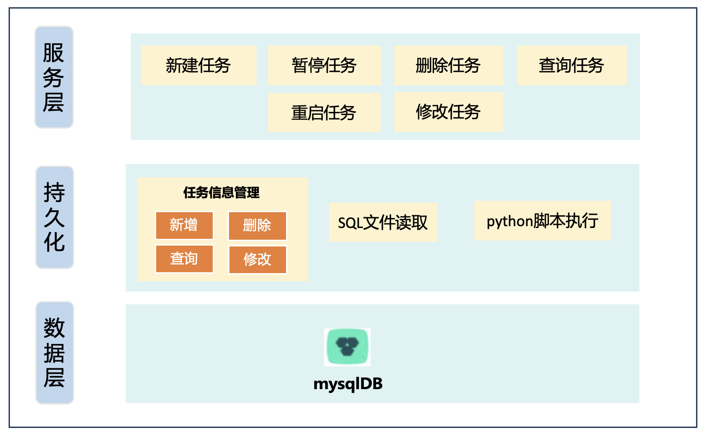
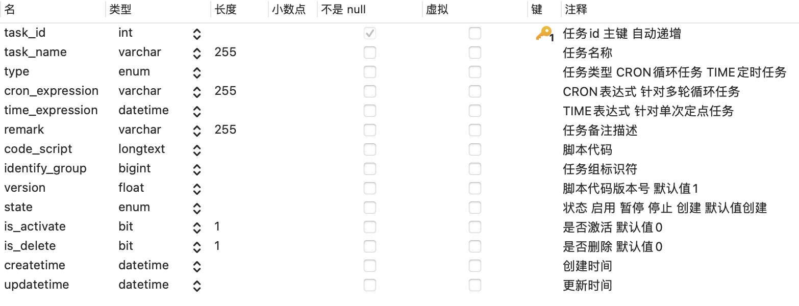

# quartz-task

## 接口文档

swagger2 ： http://127.0.0.1:8080/swagger-ui.html

在线接口文档： ~~http://121.37.188.176:8080/swagger-ui.html~~

语雀在线接口文档：

## 配置文件

`utils` 包路径下的 `PropertyLoader.java`

```java
InputStream input = PropertyLoader.class.getClassLoader().getResourceAsStream("application.properties")
```

`resource` 目录下的 `application.properties` 文件

```properties
# application name
myapp.name=Quartz Task
#port
server.port=
# database
spring.datasource.url=
spring.datasource.username=
spring.datasource.password=
# py script intercpter path
py.intercpter=
```

## 项目模块信息

### 开发环境

- 操作系统：MacOS
- 开发工具：IntelliJ IDEA
- 版本管理：Git
- JAVA：JDK1.8
- Maven：Apache Maven 3.8
- MySQL: 5.7（后面切换成了8.0）

### 技术路线

- SpringBoot 2.0
- 数据库 Mysql 5.6
- 任务调度 Spring Quartz 2.3
- 接口文档 Swagger 2
- 日志 Logback

### 架构

❗️该图有待完善


### 数据库表设计

`task`表设计



[//]: # (|       列名        |   数据类型   |  长度 |        默认值        |            备注            |)

[//]: # (|:---------------:|:--------:|----:|:-----------------:|:------------------------:|)

[//]: # (|     task_id     |   int    | 255 |       自动递增        |         任务ID 主键          |)

[//]: # (|    task_name    | varchar  | 255 |       NULL        |           任务名称           |)

[//]: # (|      type       |   enum   |     |       NULL        | 枚举任务类型 CRON循环任务 TIME定时任务 |)

[//]: # (| cron_expression | varchar  | 255 |       NULL        |     Cron表达式 针对循环多轮任务     |)

[//]: # (| time_expression | datetime |     |       NULL        |      时间表达式 针对单次定点任务      |)

[//]: # (|     remark      | varchar  | 255 | CURRENT_TIMESTAMP |           备注描述           |)

[//]: # (|   code_script   | longtext |     |                   |           脚本代码           |)

[//]: # (|     version     |   flot   |     |         1         |      脚本代码版本号 默认为1.0      |)

[//]: # (|      state      |   enum   |     |                   |     脚本代码状态 启用 暂停 停止      |)

[//]: # (|   is_activate   |   bit    |     |                   |         脚本代码是否激活         |)

[//]: # (|    is_delete    |   bit    |     |                   |           逻辑删除           |)

[//]: # (|   createtime    | datetime |     | CURRENT_TIMESTAMP |    创建时间 得到的是当前时间戳值        |)

[//]: # (|   updatetime    | datetime |     | CURRENT_TIMESTAMP |    更新时间 修改时根据当前时间戳更新     |)

`task`建表语句

```sql
SET NAMES utf8mb4;
SET
FOREIGN_KEY_CHECKS = 0;

-- ----------------------------
-- Table structure for tasks
-- ----------------------------
DROP TABLE IF EXISTS `tasks`;
CREATE TABLE `tasks`
(
    `task_id`         int(255) NOT NULL AUTO_INCREMENT COMMENT '任务id 主键 自动递增',
    `task_name`       varchar(255) DEFAULT NULL COMMENT '任务名称\n',
    `type`            enum('CRON','TIME') DEFAULT NULL COMMENT '任务类型 CRON循环任务 TIME定时任务',
    `cron_expression` varchar(255) DEFAULT NULL COMMENT 'Cron表达式 针对多轮循环任务',
    `time_expression` datetime     DEFAULT NULL COMMENT '时间表达式 针对单次定点任务',
    `remark`          varchar(255) DEFAULT NULL COMMENT '备注描述',
    `code_script`     longtext COMMENT '脚本代码',
    `version`         float unsigned DEFAULT '1' COMMENT '脚本代码版本号 默认为1.0',
    `state`           enum('ENABLED','PAUSED','STOPPED') DEFAULT NULL COMMENT '脚本代码状态 启用 暂停 停止',
    `is_activate`     bit(1)       DEFAULT NULL COMMENT '是否激活',
    `is_delete`       bit(1)       DEFAULT NULL COMMENT '逻辑删除',
    `createtime`      datetime     DEFAULT CURRENT_TIMESTAMP COMMENT '创建时间',
    `updatetime`      datetime     DEFAULT CURRENT_TIMESTAMP ON UPDATE CURRENT_TIMESTAMP COMMENT '更新时间',
    PRIMARY KEY (`task_id`) USING BTREE
) ENGINE=InnoDB AUTO_INCREMENT=65 DEFAULT CHARSET=utf8mb4;

SET
FOREIGN_KEY_CHECKS = 1;

```

### 功能

📄**要求接口文档**

- 请求地址
- 请求方式
- 入参
- 出参

后续写个语雀接口文档

#### 接口出入参数

创建并开启多次循环任务

```text
URL:http://localhost:8080/tasks/createLoopTask
Request:POST
RequestBody
{
  "taskName": "任务111",
  "cronExpression": "0 0 1 ? * L",
  "taskType": "CRON",
  "remark": "任务111， 每周星期天凌晨1点实行一次"
}
ResponseBody
{
  "status": 1.0,
  "desc": "成功创建并开启多次循环任务"
}
```

创建并开启执行单次定时任务

```text
URL:http://localhost:8080/tasks/createOnceTimeTask
Request:POST
RequestBody
{
  "taskName": "定时任务1",
  "timeExpression": "2023-11-30 14:35:38",
  "taskType": "TIME",
  "remark": "测试定时任务"
}
ResponseBody
{
  "status": 1.0,
  "desc": "成功创建单次定时任务并开启执行"
}
```

修改任务 分别针对cron和time修改

```text
URL:http://localhost:8080/tasks/{taskId}
Request:PUT
Query
taskId:57
RequestBody
{
  "taskName": "定时任务345",
  "timeExpression": "2023-11-30 14:48:15",
  "taskType": "TIME",
  "remark": "测试更新修改定时任务"
}
ResponseBody
{
  "status": 1.0,
  "desc": "成功修改单次任务"
}

URL:http://localhost:8080/tasks/{taskId}
Request:PUT
Query
taskId:60
RequestBody
{
  "taskName": "更新id为60任务",
  "cronExpression": "0 */1 * * * ?",
  "taskType": "CRON",
  "remark": "对任务进行了需改，每隔1分钟执行一次"
}
ResponseBody
{
  "status": 1.0,
  "desc": "成功修改循环任务"
}
```

## 表达式样例

循环任务使用cron表达式

单次任务使用time表达式

### CRON

[CRON表达式生成 🚪 ](https://cron.qqe2.com/)

    每隔5秒执行一次：*/5 * * * * ?

    每隔1分钟执行一次：0 */1 * * * ?

    每天23点执行一次：0 0 23 * * ?

    每天凌晨1点执行一次：0 0 1 * * ?

    每月1号凌晨1点执行一次：0 0 1 1 * ?

    每月最后一天23点执行一次：0 0 23 L * ?

    每周星期天凌晨1点实行一次：0 0 1 ? * L

    在26分、29分、33分执行一次：0 26,29,33 * * * ?

    每天的0点、13点、18点、21点都执行一次：0 0 0,13,18,21 * * ?
    
    0 0/5 * * *  在每小时的第0分钟和第5分钟执行任务。因此，该任务将在每小时的第0分钟、第5分钟和第10分钟执行三次。

    0 * 14 * * ? 在每天下午2点到2点59分每分钟执行一次

    0 0/5 14 * * ? 在每天下午2点到2点59分，每5分钟执行一次

    0 0/5 14,18 * * ? 在每天下午2点到2点59分和下午6点到6点59分，每5分钟执行一次

    0 0 12 * * ? 在每天中午12点执行一次

    0 15 10 ? * * 在每天上午10点15分执行一次

    0 45 23 ? * * 在每天晚上11点45分执行一次

### TIME

    2023-09-13 17:41:00
    
    2023-09-19 17:41:00

## 进度 🧑‍💻

> 根据开发进度和需求变化进行修改

- ✅task任务创建时间 更新时间 
- ✅补上代码注释 
- ✅增加cron表达式合法性校验（添加和修改的时候需要校验合法性）
- ✅集成swagger在线接口文档
- ✅完善api在线接口文档 
- ✅查内存任务信息 （可优化拆分成详细信息查询 和 分别给出任务状态总数的任务统计信息）
- ✅单次定点时间任务执行（只跑一次任务就结束）
- ✅单次定点时间合法性校验 
- ~~传入任务对象 任务不触发 任务信息存入数据库 存入内存或者 存入数据库不上内存 触发~~ （前端控制了创建任务都先挂起暂停）❌
- ~~从db中拿已有任务上内存触发~~ ❌（运行起来是一致的）
- ~~譬如 我只是需要修改db中的任务 不让他修改了就执行~~ ❌（同上）
- ✅增加三个字段
    - ✅任务描述（备注）；
    - ✅任务类型 枚举；
    - ✅long text类型的code（前端富文本）考虑一个问题🤔 ~~如何判断他是python 还是sql~~ (sql后面也统一到py脚本里)
- ✅大字段存py脚本，
- 多任务列表 多任务执行
  - 脚本执行逻辑需改 每次从db中拿到code_script 并且执行的是is_activate为1的
  - 修改任务做整改 修改任务实则是新增一条需改后的数据 并且将被修改的那条is_activate为0 保证一组只有一个is_activate为1的数据
- 考虑任务的py版本 是否生效 版本记录
  - 开新接口 一组的版本代码查询 
- ✅脚本代码状态 创建 启用 暂停 停止
- 统一py脚本流程逻辑 脚本输出信息 （后续出统一模版）
- 切换8.0版本数据库 ✅
- 数据库表物理删除改为逻辑删除 ✅ 考虑一个问题🤔 是否需要设置删除撤销 这里内存调度任务如何做 db中从id拿来直接重新创建 失火🔥
- 查询数据库任务接口优化
  - 查询得到的结果是 生效的 一组只有一个is_activate为1的  逻辑删除为0的 
  - 考虑一些 启动 停止状态 数据
- ✅标识符生成 时间戳解决identify 考虑一个问题🤔 UUID太长了128位，时间戳规律性太强了 
  - 后续脚本代码管理进行 分组查询

## 待解决

- 查内存任务 🔧只能统计到cron循环任务，单次定点的时间任务查不到 （可查到 但是无法区分出来时间任务和循环任务）
- 删除任务 ~~考虑一种需要补充的情况 删除的时候 db中有 但是他并不在内存中~~ (使用应是一致统一的)
- 修改任务 ✅需要增加修改time表达式 
- 修改任务 传的id不存在不报错
- 配置文件 ✅集成抽取配置文件的值，统一写到`yml`或者`properties`文件中 

## 集成问题

多任务功能做了之后留意这个问题 `ExecutePythonScript` 有时会脚本错误 

## 一些思考🤔️

    关于结构设计
        面向对象之策略模式

    关于任务状态
        单次定点时间任务是 在内存中执行完便直接删掉
        循环定时任务 COMPLETE（已完成）是针对循环次数的cron表达式莫🤔还没看到过这个状态

    关于单次执行任务 开启就放入内存 执行任务 跑完就从内存删除了 存入数据库有什么意义呢？（数据库表设计逻辑删除）

    关于数据库表 增加逻辑删除列？ 增加是否是单次任务、循环任务标识列 ？

    单次任务与循环任务 增删改可公用service层方法吗！？
        目前来看查内存吐信息是可以公用的😊

    关于controller接口返回值参数设计 
        前端也做成管理 分别可以查到数据库中的任务和内存的任务（两个管理页面）
        做成了管理 那么是否给出一些常用功能 譬如taskName 模糊搜索、分页查询、

    关于db里数据量
        专利数据量亿级；机构、论文都是千万级数据量；新闻数据量是百万级 
        已经建了 BTREE索引

**quartz 失火策略**

Quartz还提供了Misfire处理机制，以便在错过某个作业执行时间时进行处理，并保证作业能够在下一个适当的时间被执行。

Misfire：到了任务触发时间点，但是任务没有被触发。
